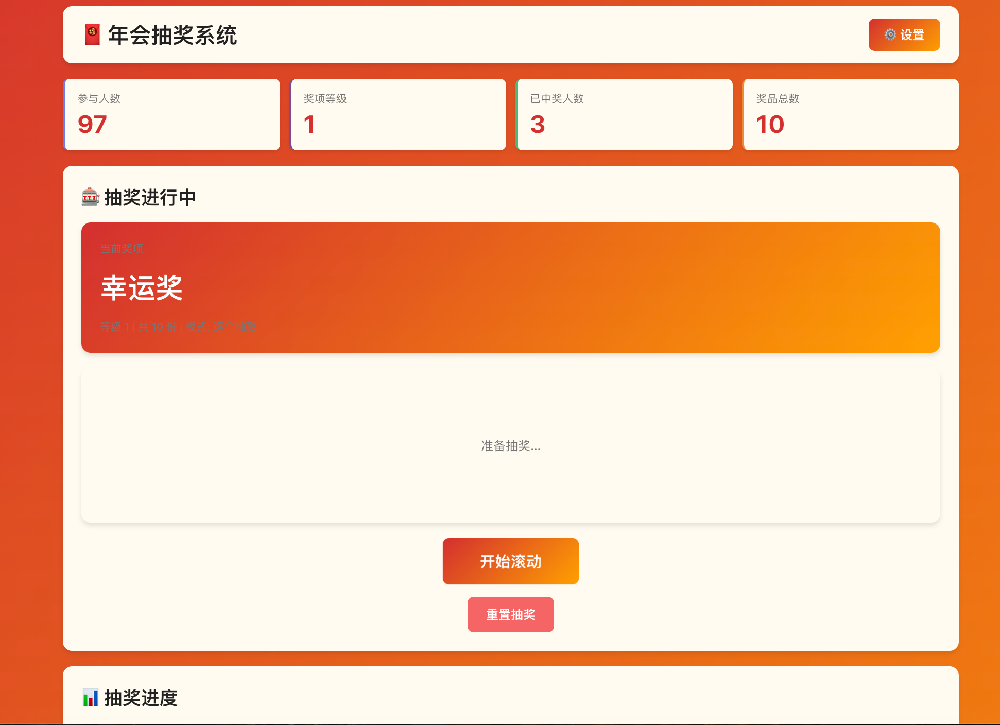

# 🧧 年会抽奖系统

一个专为年会设计的抽奖网页应用，采用中国新年主题，支持多种抽取模式，具有完整的主题切换功能和精美的动画效果。

## 🖼️ 界面预览



> 春节庆典主题下的首页界面，红色背景金色点缀，喜庆热烈

## ✨ 功能特性

### 核心功能
- 📥 **数据导入** - 支持CSV/TXT文件上传或文本粘贴导入员工数据
- 🎁 **奖品配置** - 多等级奖品配置，支持预设模板和自定义
- 🎰 **双模式抽奖**
  - 逐个抽取：每次抽取一名，有滚动动画，增加悬念
  - 一次性抽取：一次性抽取所有名额，人名闪动动画
- 🎨 **主题系统** - 5种精美主题可选
  - 🧧 春节庆典（默认）：红金配色，最适合春节年会
  - 🌟 金色华章：金色渐变，富贵典雅
  - 🇨🇳 中国红：国旗配色，国庆氛围
  - 🌕 中秋团圆：蓝金渐变，月圆主题
  - 💼 商务简约：紫色渐变，现代简约
- 🚫 **防重复中奖** - 已中奖员工自动从后续抽奖中排除
- 💾 **数据持久化** - LocalStorage自动保存所有数据
- 📊 **结果展示** - 按奖项分组显示，完整中奖列表，统计数据
- 📄 **数据导出** - 支持导出CSV和TXT格式

### 界面特色
- 🎯 **简洁设计** - 首页直接抽奖，设置集中在侧边菜单
- 🎊 **节日氛围** - 中国新年主题，红金配色，喜庆热烈
- ✨ **流畅动画** - 滚动动画、脉动效果、渐变色彩
- 📱 **响应式布局** - 适配各种屏幕尺寸

## 🌐 在线体验

**GitHub Pages 演示**：[https://yourusername.github.io/lottery-app/](https://yourusername.github.io/lottery-app/)

> 🎊 可以直接在线体验，无需安装！

## 🚀 快速开始

### 环境要求
- Node.js 16+
- npm 或 yarn

### 安装依赖

```bash
git clone <repository-url>
cd lottery-app
npm install
```

### 启动开发服务器

```bash
npm run dev
```

应用将在 `http://localhost:3000` 打开

### 构建生产版本

```bash
npm run build
```

构建产物在 `dist` 目录，可部署到任何静态服务器

## 📖 使用指南

### 1️⃣ 导入员工数据

**方式一：上传文件**
- 点击"设置" → "导入数据"
- 点击"选择文件"上传CSV或TXT文件

**方式二：粘贴文本**
- 在文本框中直接粘贴员工数据
- 格式：`姓名,工号`（每行一个）

示例数据：
```
张三,E001
李四,E002
王五,E003
```

### 2️⃣ 配置奖品

**快速配置：**
- 点击"加载预设配置"
- 自动加载5级奖品（幸运奖→特等奖）

**手动配置：**
- 设置等级（数字越大越先抽）
- 输入奖品名称
- 设置数量

**抽取模式：**
- **逐个抽取**：适合营造悬念和仪式感
- **一次性抽取**：适合快速高效完成抽奖

点击"💾 保存配置"

### 3️⃣ 选择主题（可选）

- 点击"设置" → "🎨 主题设置"
- 选择喜欢的主题卡片
- 主题立即生效，自动保存

### 4️⃣ 开始抽奖

**逐个抽取模式：**
1. 点击"开始滚动"
2. 人名快速滚动（50ms间隔）
3. 点击"停止"显示中奖者
4. 继续抽取直到当前奖项完成
5. 点击"下一等级"进入下一奖项

**一次性抽取模式：**
1. 点击"开始滚动"
2. 多个卡片同时闪动（80ms间隔）
3. 点击"停止"一次性显示所有中奖者
4. 点击"下一等级"继续

### 5️⃣ 查看结果

- 点击"设置" → "📋 中奖名单"
- 按奖项分组查看
- 点击"导出CSV"或"导出TXT"下载

## 🎯 抽奖规则

1. **抽奖顺序**：从高等级到低等级（特等奖→一等奖→...→幸运奖）
2. **防重复**：已中奖员工自动从后续抽奖中排除
3. **公平性**：所有未中奖员工机会均等
4. **数据保存**：所有数据实时保存，刷新页面不丢失

## 🎨 主题说明

### 🧧 春节庆典（推荐）
- **配色**：红色→金色渐变
- **适用场景**：春节年会、新年庆典
- **氛围**：喜庆热烈、吉祥如意

### 🌟 金色华章
- **配色**：金色三色渐变
- **适用场景**：高端企业年会、答谢宴
- **氛围**：富贵典雅、大气磅礴

### 🇨🇳 中国红
- **配色**：国旗红黄配色
- **适用场景**：国庆、建党节等节日
- **氛围**：庄重热烈、爱国情怀

### 🌕 中秋团圆
- **配色**：深蓝→金色渐变
- **适用场景**：中秋活动、家庭聚会
- **氛围**：温馨浪漫、月圆人圆

### 💼 商务简约
- **配色**：紫蓝渐变
- **适用场景**：科技企业、互联网公司
- **氛围**：现代简约、专业高效

## 📁 项目结构

```
lottery-app/
├── src/
│   ├── pages/              # 页面组件
│   │   ├── ImportData.jsx   # 数据导入页
│   │   ├── PrizeConfig.jsx  # 奖品配置页
│   │   ├── Lottery.jsx      # 抽奖页面
│   │   ├── Results.jsx      # 结果展示页
│   │   └── ThemeSettings.jsx # 主题设置页
│   ├── config/
│   │   └── themes.js        # 主题配置
│   ├── styles/
│   │   └── global.css       # 全局样式（CSS变量）
│   ├── App.jsx             # 主应用组件
│   └── main.jsx            # 应用入口
├── public/
│   └── 示例数据.csv         # 示例员工数据
├── screenshots/            # 截图目录
├── index.html
├── package.json
├── vite.config.js
└── README.md
```

## 🛠️ 技术栈

- **前端框架**: React 18
- **路由管理**: React Router 6
- **构建工具**: Vite 5
- **数据存储**: LocalStorage
- **样式方案**: CSS变量 + 原子CSS
- **开发语言**: JavaScript (JSX)

## 📝 数据格式

### 员工数据
```json
{
  "id": "E001",
  "name": "张三"
}
```

### 奖品配置
```json
{
  "level": 10,
  "name": "特等奖",
  "count": 1
}
```

### 中奖记录
```json
{
  "employeeId": "E001",
  "employeeName": "张三",
  "prizeName": "特等奖",
  "prizeLevel": 10,
  "timestamp": "2026-02-08T12:00:00.000Z"
}
```

### 应用数据结构
```json
{
  "employees": [],     // 员工列表
  "prizes": [],        // 奖品配置
  "winners": [],       // 中奖记录
  "currentLevel": 0,   // 当前奖项索引
  "drawMode": "single",// 抽取模式
  "theme": "spring"    // 主题ID
}
```

## ⚠️ 注意事项

1. **数据备份**
   - 数据保存在浏览器LocalStorage
   - 清除浏览器缓存会丢失数据
   - 建议定期导出中奖名单作为备份

2. **奖品数量**
   - 确保奖品总数不超过员工人数
   - 系统会自动提示但不强制限制

3. **浏览器兼容**
   - 推荐使用Chrome、Firefox、Edge最新版本
   - 不支持IE浏览器

4. **操作建议**
   - 重置数据操作不可恢复，请谨慎
   - 建议在抽奖前测试所有功能
   - 大屏幕显示效果更佳

## 🎯 使用场景

- 🏢 **企业年会** - 员工抽奖、奖品分发
- 🎊 **节日庆典** - 春节、中秋、国庆等活动
- 🎪 **团队建设** - 聚会、团建抽奖环节
- 🏫 **校园活动** - 学生会、社团活动
- 🎁 **客户答谢** - 客户抽奖、答谢宴

## 🔧 开发说明

### 本地开发
```bash
# 安装依赖
npm install

# 启动开发服务器
npm run dev

# 构建生产版本
npm run build

# 预览生产构建
npm run preview
```

### 自定义主题
编辑 `src/config/themes.js`，添加新主题对象：

```javascript
{
  id: 'custom',
  name: '自定义主题',
  colors: {
    primary: '#FF0000',
    secondary: '#00FF00',
    accent: '#0000FF',
    background: 'linear-gradient(135deg, #FF0000 0%, #00FF00 100%)',
    cardBackground: '#FFFFFF',
    text: '#000000',
    textSecondary: '#666666',
    buttonText: '#FFFFFF'
  },
  elements: {
    emoji: '🎉',
    decoration: '⭐',
    pattern: 'custom'
  }
}
```

## 🌐 GitHub Pages 部署

本项目支持一键部署到 GitHub Pages，完全免费！

### 快速部署

```bash
# 1. 推送到 GitHub
git init
git add .
git commit -m "Initial commit"
git branch -M main
git remote add origin https://github.com/yourusername/lottery-app.git
git push -u origin main
```

### 配置 GitHub Pages

1. 进入仓库 **Settings** → **Pages**
2. **Source** 选择：GitHub Actions
3. 等待自动部署完成

### 访问地址

```
https://yourusername.github.io/lottery-app/
```

详细步骤请查看：[DEPLOYMENT.md](DEPLOYMENT.md)

## 🤝 贡献

欢迎提交Issue和Pull Request！

## 📄 License

MIT License

## 🙏 致谢

感谢所有为这个项目做出贡献的开发者！

---

**祝您年会顺利，大家好运！** 🧧🎊🎉
